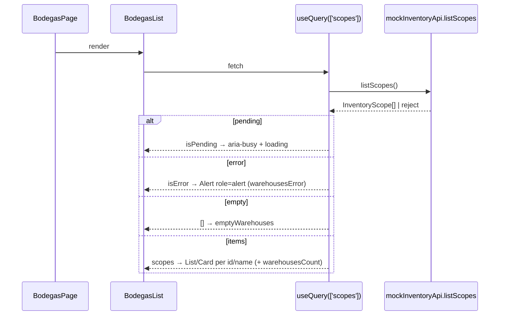

# Design: BodegasList Query Wiring

## Technical Approach

Mock-first mirror of `features/dashboard/DashboardKpis.tsx`: new `features/bodegas/BodegasList.tsx` calls `useQuery({ queryKey: ['scopes'] })` against `mockInventoryApi.listScopes()`, renders AntD `List`/`Card` grid. Deterministic `InventoryScope { id, name }` fixtures replace mock `[]`; `BodegasPage` swaps `PlaceholderPage` for `<BodegasList />`. Overrides frontend-design Table gate: no `<Table>` primitive exists — out of scope.

**Execution declaration:** this change is the execution of deferred `frontend-screens-v2` task 1d (bodegas list scope); traceability: proposal Dependencies/Risks → design → tasks 1d scope.

## Architecture Decisions

| Option | Tradeoff | Decision |
|---|---|---|
| `queryKey: ['scopes']` vs `['warehouses']` | `scopes` matches port noun (`listScopes`/`InventoryScope`); `warehouses` matches UI copy | `['scopes']` — aligns cache key with port contract |
| Query mock directly vs inject port prop | Prop injection aids future HTTP swap but adds indirection this slice does not need | Call `mockInventoryApi` directly, mirroring `DashboardKpis` |
| Fixture constant in `fixtures.ts` vs inline in `mock.ts` | Inline is shorter; constant is reusable/testable | `scopeFixtures` in `fixtures.ts`; `mock.ts` returns mapped copies (`map(s => ({...s}))`, cf. `getOperatorLines`) |
| AntD `List` grid vs `Row`/`Col` only | `List grid` gives built-in empty/render props; raw grid is more flexible | `List` + `grid={{ xs:1, sm:2, lg:3 }}` with `Card` items; `Row`/`Col` equivalent (`xs=24/sm=12/lg=8`) acceptable |
| `es.json` new keys vs reuse only | Reuse minimizes churn; count/error have no existing keys | Reuse `app.warehouses`, `app.emptyWarehouses`; add `app.warehousesCount`, `app.warehousesError` |

## Data Flow

`BodegasPage` → `BodegasList` → `useQuery(['scopes'])` → `mockInventoryApi.listScopes()` → `scopeFixtures` copy. Branch on `isPending` / `isError` / `data.length === 0` / items. All copy via `t()`.



## File Changes

| File | Action | Description |
|---|---|---|
| `src/features/bodegas/BodegasList.tsx` | Create | `useQuery(['scopes'])`, `List`/`Card`/`Alert`, `t()` copy, `aria-busy`/`role="alert"` states |
| `src/features/bodegas/BodegasList.test.tsx` | Create | Co-located; RED empty + populated, plus pending/error; mirrors `DashboardKpis.test.tsx` providers |
| `src/shared/api/inventory/fixtures.ts` | Modify | Add `scopeFixtures: InventoryScope[]` (3 rows `{id, name}`, no `code`) |
| `src/shared/api/inventory/mock.ts` | Modify | `listScopes()` returns fixture copies instead of `[]` |
| `src/pages/screens.tsx` | Modify | `BodegasPage` renders `<BodegasList />`; drop `PlaceholderPage` usage there |
| `src/app/i18n/es.json` | Modify | Add `app.warehousesCount`, `app.warehousesError`; reuse title/empty keys |
| `src/shared/ui/primitives/` | Untouched | No `Table` primitive in this change |
| `src/shared/api/inventory/http.ts` | Untouched | `listScopes` stays disabled |

**Out of scope (Requirement 7 — Scope boundary):** search, filter, sort, pagination, detail view, HTTP adapter enablement (`http.ts` stays disabled), mock-contract validator, generic `Table` primitive (`primitives/` untouched). None receive code in this change.

## Interfaces / Contracts

```ts
// models.ts (unchanged)
type InventoryScope = { id: string; name: string };
// fixtures.ts (new)
export const scopeFixtures: readonly InventoryScope[] = [
  { id: 'scope-centro', name: 'Bodega Centro' },
  { id: 'scope-norte', name: 'Bodega Norte' },
  { id: 'scope-sur', name: 'Bodega Sur' },
];
```

`es.json`: `warehousesCount: "N bodegas"` (interpolated `{{count}}`), `warehousesError: "No se pudieron cargar las bodegas."`

## Testing Strategy

| Layer | What to Test | Approach |
|---|---|---|
| Unit | Fixture shape `{id,name}`, no `code`; copy mapping in `mock.ts` | Vitest assertions on `scopeFixtures` |
| Integration | loading (`aria-busy`), items (3 cards keyed by `id`), empty (`emptyWarehouses`), error (`role="alert"`) | RTL + `QueryClient(retry:false)` + mocked `listScopes`, strict TDD RED first (`npm run test:run`) |
| E2E | None | Out of scope (`e2e/` empty); responsive verified via AntD grid classes |

## Threat Matrix

N/A — no routing, shell, subprocess, VCS/PR automation, executable-file classification, or process-integration boundary.

## Migration / Rollout

No migration. Single PR: fixtures + mock + component + tests + `screens.tsx` swap + `es.json` keys. Rollback: revert PR (restore placeholder, `[]`, drop slice/keys). Budget: 1 PR, ~6 files, no backend state.
